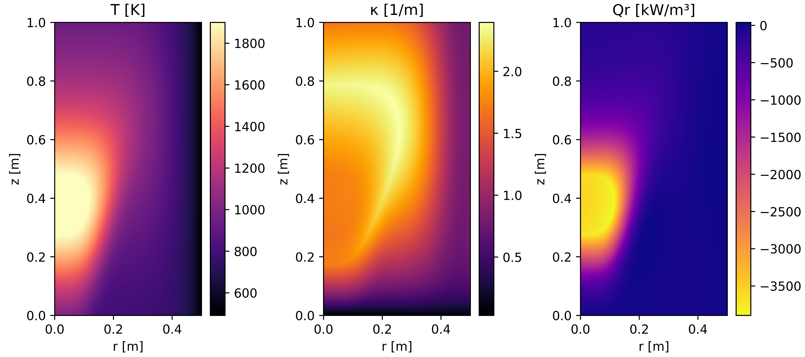

# axisymmetric-dom-cpp 

A compact C++ implementation of the discrete ordinates method (DOM) for
radiative heat transfer in a gray, absorbing-emitting, non-scattering medium.
The solver uses axisymmetric `(r, z)` coordinates, S10 quadrature, and STEP
(first-order upwind) spatial differencing.

 

 

Open [`example.ipynb`](example.ipynb) to define temperature and absorption
coefficient distributions, create the input file, compile the solver, and plot
the result. The notebook requires NumPy and Matplotlib.

See [`THEORY.md`](THEORY.md) for the equations and their mapping to the code.

## Reference

M. Fathi, R. Hosseini, and M. Rahmani,
“Calculations of non-gray gas radiative heat transfer by coupling the discrete
ordinates method with the Leckner model in 3D rectangular enclosures,”
*Heat and Mass Transfer* (2016).
[doi:10.1007/s00231-015-1748-3](https://doi.org/10.1007/s00231-015-1748-3)

 
